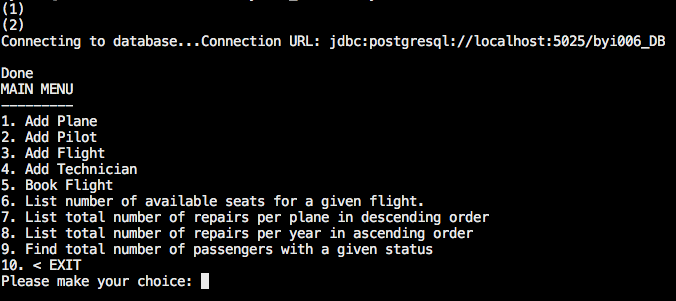
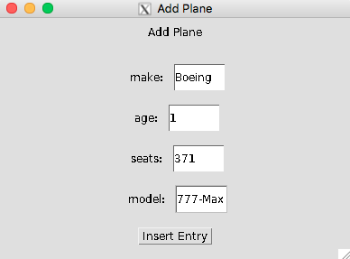
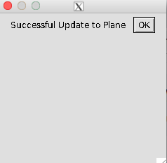
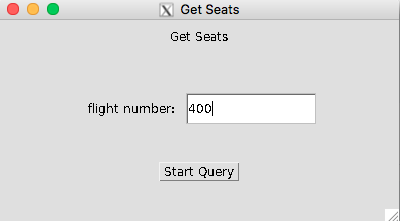
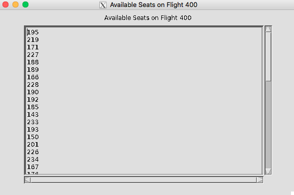

# CS166 Final Project Phase 3
**Authors: Brandon Yi and Moses Park**

This project implements a few functionalities one might find in a airline management system. 

# 1. Examples

All queries and updates must be selected using the main menu in the terminal. To choose an option, enter a number 1-10.

{width=75%}

After choosing an option from the terminal, a window will be created for you to interact with. The contents of the window will vary depending on what option you choose.

## Inserting Data

This is an example of a window where users will perform queries:

{width=50%}


After pressing the **Insert Entry** button, the following alert will appear:

{width=50%}

## Querying Data

{width=50%}

{width=45%}

The two windows above show how to execute a query and see the results. The first window to appear is an input window. After inputing the required parameters, another window will appear to show the results.

# 2. Deploying

## Dependencies

1. Java (and java.awt)
2. Postgres

*Note: For remote connections, enable X Forwarding*

## Start the Application

```bash
# Clone the git repo
git clone https://github.com/bypie5/CS166_final_project.git
cd CS166_final_project

# Deploy postgresql server
cd code/postgresql
source ./createPostgreDB.sh
source ./startPostgreDB.sh

# Start java application
cd ../java
./compile.sh

# ex: source ./run.sh byi006_DB 5025 byi006
source ./run.sh $USER"_DB" $PGPORT $USER
```

